<div align="center">



# vievek sharmaa

### n8n Automation · AI Builder · Jaipur, Rajasthan 🇮🇳

[](https://your-portfolio-url.com)
[](mailto:vieveksharmaa@gmail.com)
[](https://github.com/vieveksharmaa)
[](https://linkedin.com/in/YOUR_LINKEDIN)
[](https://wa.me/917733977655)

</div>

---

## What I build

I build **n8n automation workflows** that eliminate manual work — triggered by payments, form submissions, or webhooks — and deliver personalised WhatsApp messages, emails, and PDFs without anyone touching them.

Combined with AI agents, full-stack Next.js apps, and RAG pipelines — I build complete products, not just isolated scripts.

---

## Selected Projects

### ⚡ [India Kids Talent Championship](https://your-portfolio-url.com/kidstar-case-study.html) &nbsp;·&nbsp; Client Work · In Production
> n8n · Razorpay · WhatsApp · Supabase · Next.js 15 · Resend

Full-stack nominations platform with **n8n-powered WhatsApp onboarding, payment recovery flows, and auto-certificate delivery**. 91.2% payment conversion. Built solo for Bharat Good Times — 5,000+ participant capacity.

`n8n` `Next.js 15` `Supabase` `Razorpay` `Resend` `WhatsApp`

---

### ⚡ [Vidhanm — Sacred Atelier](https://vidhanm.com) &nbsp;·&nbsp; [case study](https://your-portfolio-url.com/vidhanm-case-study.html)
> n8n · WooCommerce · Next.js 15 · Razorpay · Vercel

Premium spiritual e-commerce platform with **n8n post-purchase automation** — order confirmation, astrologer assignment, shipping triggers, customer WhatsApp. Headless WooCommerce + full brand system.

`n8n` `Next.js 15` `WooCommerce API` `Razorpay` `TypeScript` `Vercel`

---

### 🤖 [Job Search Co-Pilot](https://job-search-copilot-rho.vercel.app/) &nbsp;·&nbsp; [repo](https://github.com/vieveksharmaa/job-search-copilot)
> Vercel AI SDK · Next.js 14 · Anthropic Claude · TypeScript

5-step agentic AI pipeline — resume rewrite, cover letter, and interview questions in under 30 seconds. `streamText` + `toolChoice: 'required'` for reliable multi-tool streaming.

`Next.js 14` `Vercel AI SDK` `TypeScript` `Zod` `Claude Haiku`

---

### 🔍 [Multi-Source RAG with Citations](https://huggingface.co/spaces/vieveksharmaa/multi-source-rag) &nbsp;·&nbsp; [repo](https://github.com/vieveksharmaa/multi-source-rag)
> LangChain · LangGraph · Python · HuggingFace

RAG that ingests YouTube, PDFs, web pages, and GitHub repos — answers with exact citations including timestamps and page numbers. Every provider swappable via `.env`. Live on HuggingFace.

`Python` `LangChain` `LangGraph` `ChromaDB` `FastAPI` `Docker`

---

### 🛍️ [Product Description Generator](https://github.com/vieveksharmaa/product-description-generator)
> Ollama · Python · Local LLM · Open Source

AI e-commerce copy generator running entirely locally — no API keys, no cost. Desktop GUI + CLI, four tones, live streaming output.

`Python` `Ollama` `Tkinter` `Llama 3.2`

---

## n8n Automation Stack

```
Triggers      →  Razorpay Webhook · Form · HTTP · Schedule · WooCommerce
Actions       →  WhatsApp · Email (Resend) · PDF Generate · Supabase · Google Sheets
AI Inside n8n →  OpenAI · Claude · Switch Node · IF Node · AI Agent Node
Infra         →  Self-hosted n8n · Vercel · Docker · Cloudflare
```

---

## Full Stack

```
Automation    →  n8n  ★ primary
AI & Agents   →  Vercel AI SDK · LangChain · LangGraph · Anthropic · OpenAI · Ollama
Frontend      →  Next.js 15 · TypeScript · Tailwind CSS · React Server Components
Backend & DB  →  Supabase · FastAPI · WooCommerce REST API
Payments      →  Razorpay (webhooks + checkout)
Infra         →  Vercel · HuggingFace Spaces · Docker · Cloudflare
```

---

<div align="center">

### 🟢 Open to remote n8n automation & AI projects

**[vieveksharmaa@gmail.com](mailto:vieveksharmaa@gmail.com)** &nbsp;·&nbsp; **[WhatsApp](https://wa.me/917733977655)** &nbsp;·&nbsp; **[Portfolio](https://your-portfolio-url.com)**

*I build automations that run while you sleep.*

</div>
